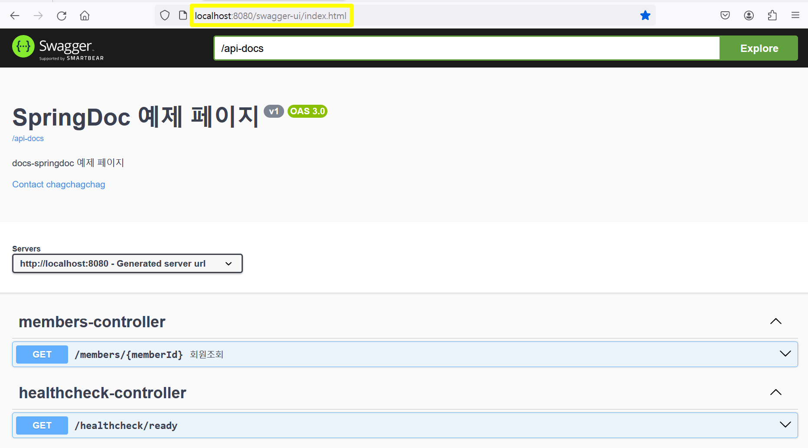

## Springdoc 시작하기
다른 작업도 해야 해서 아주 기초적인 설정 방법에 대해서만 급하게 정리해둡니다.<br/>
시간이 될 때마다 고급 설정 등에 대해 정리를 추가해나가도록 하겠습니다.<br/>


## 참고

참고자료

- Spring Doc Official : [springdoc.org](https://springdoc.org/)
- Springdoc-openapi Properties : [Springdoc-openapi Properties](https://springdoc.org/#properties)
- springfox 와 다른 점 :  [Differentiation to Springfox project](https://springdoc.org/#differentiation-to-springfox-project)
- webflux 의 함수형 엔드포인트 지원 방식 : [Spring-webflux/webmvc fn Functional Endpoint](https://springdoc.org/#spring-webfluxwebmvc-fn-with-functional-endpoints)

<br/>


## springfox, springdoc

springfox 의 swagger 는 Spring 3.x 부터는 사용이 불가능합니다. 그래서 3.x 버전의 spring 을 사용할 경우 springdoc 를 사용하는 것이 권장됩니다.

springfox 와 다른 점은 [Differentiation to Springfox project](https://springdoc.org/#differentiation-to-springfox-project) 을 참고해주세요.<br/>

Spring Doc 에 대한 자세한 설명은 https://springdoc.org/ 에서 설명하고 있습니다. <br/>

[https://springdoc.org](https://springdoc.org) 에서는 webflux 역시 지원하고 있으며 관련된 항목은 [Spring-webflux/webmvc fn Functional Endpoint](https://springdoc.org/#spring-webfluxwebmvc-fn-with-functional-endpoints) 에서 확인 가능합니다.<br/>


## 의존성 추가

3.x 이전 버전

```kotlin
implementation("org.springdoc:springdoc-openapi-ui:1.7.0")
```

3.x 이후 버전

```kotlin
implementation("org.springdoc:springdoc-openapi-starter-webmvc-ui:2.5.0")
```

<br/>


## application.yml

```yaml
springdoc:
  default-consumes-media-type: application/json;charset=UTF-8
  default-produces-media-type: application/json;charset=UTF-8
  api-docs:
    path: /api-docs
    enabled: true # for dev
  swagger-ui:
    enabled: true # for dev
    path: /swagger-ui.html
    try-it-out-enabled: true
  packages-to-scan: io.chagchagchag.ddd.fastcampus_v1.membership.adapter.in.web
  cache:
    disabled: true
  version: v1
```

<br/>


## 테스트

위에서 `springdoc.swagger-ui.path` 에 설정한 경로인 http://localhost:8080/swagger-ui.html 로 접속해보면 아래와 같은 화면이 나타납니다. 주소가 http://localhost:8080/swagger-ui/index.html 로 리다이렉팅 되었음을 확인 가능합니다.



<br/>


## 부가 설정

Swagger 에 대해 별도의 설정을 해줍니다..<br/>

application.yml 파일에는`springdoc.version` 항목을 추가해줬습니다. 커스텀한 설정이고, springdoc 에서 지원하는 항목은 아닙니다. 그냥 애플리케이션 레벨에서 필요한 key/value 를 @Value 애노테이션으로 읽어들일 항목을 추가해주기 위해 정의했습니다.

```yaml
# ...
springdoc:
  # ...
  version: v1
  # ...
```

<br/>


## SpringDocConfig.java

설정 코드는 아래와 같이 추가해줬다.

```java
package io.chagchagchag.example.springdoc_example.config;

import io.swagger.v3.oas.models.Components;
import io.swagger.v3.oas.models.OpenAPI;
import io.swagger.v3.oas.models.info.Contact;
import io.swagger.v3.oas.models.info.Info;
import org.springframework.beans.factory.annotation.Value;
import org.springframework.context.annotation.Bean;
import org.springframework.context.annotation.Configuration;

@Configuration
public class SpringDocConfig {
  @Bean
  public OpenAPI openAPI(
      @Value("${springdoc.version}") String version
  ){
    Info info = new Info()
        .title("SpringDoc 예제 페이지")
        .version(version)
        .description("docs-springdoc 예제 페이지")
        .contact(
            new Contact()
                .name("chagchagchag")
                .email("chagchagchag.dev@gmail.com")
        );

    return new OpenAPI().info(info).components(new Components());
  }
}
```

<br/>


## 패키지 스캔 설정

```yaml
# ...
springdoc:
  # ...
  packages-to-scan: io.chagchagchag.example.springdoc_example
```

<br/>


## dev,prod 에 따라 swagger disable 하기

예를 들면 dev 프로필에서는 아래와 같이 설정하면 swagger 가 적용된다.

```yaml
springdoc:
  default-consumes-media-type: application/json;charset=UTF-8
  default-produces-media-type: application/json;charset=UTF-8
  api-docs:
    path: /api-docs
    enabled: true # for dev
  swagger-ui:
    enabled: true # for dev
    path: /swagger-ui.html
    try-it-out-enabled: true
  packages-to-scan: io.chagchagchag.example.springdoc_example
  cache:
    disabled: true
  version: v1
```

<br/>


prod 프로필에서는 아래와 같이 설정하면 swagger 가 disabled 된다.

```yaml
springdoc:
  api-docs:
    enabled: false
  swagger-ui:
    enabled: false
  packages-to-scan: io.chagchagchag.example.springdoc_example
  version: v1
```

<br/>


## 주요 애노테이션들

spring fox 에서 사용하던 애노테이션들은 아래와 같이 변경되었습니다.

- @Api → @Tag
- @ApiIgnore 은 아래와 같이 spring docs 에서 표현 가능
  - @Parameter(hidden) 또는 
  - @Operation(hidden = true) 또는
  - @Hidden
- @ApiImplicitParam → @Parameter
- @ApiImplicitParams → @Parameters
- @ApiModel → @Schema
- @ApiModelProperty 
- @ApiModelProperty(hidden = true) → @Schema(accessMode = READ\_ONLY)
- @ApiOperation(value = "aaa", notes = "bbb") → @Operation(summary = "aaa", description = "bbb")
- @ApiParam → @Parameter
- @ApiResponse(code = 404, message = "not found") → @ApiResponse(responseCode = "404", description = "bbb")

<br/>


## Try it 해보기

직접 request 를 수행해보면 잘 동작된다는 것을 확인 가능합니다.

 
